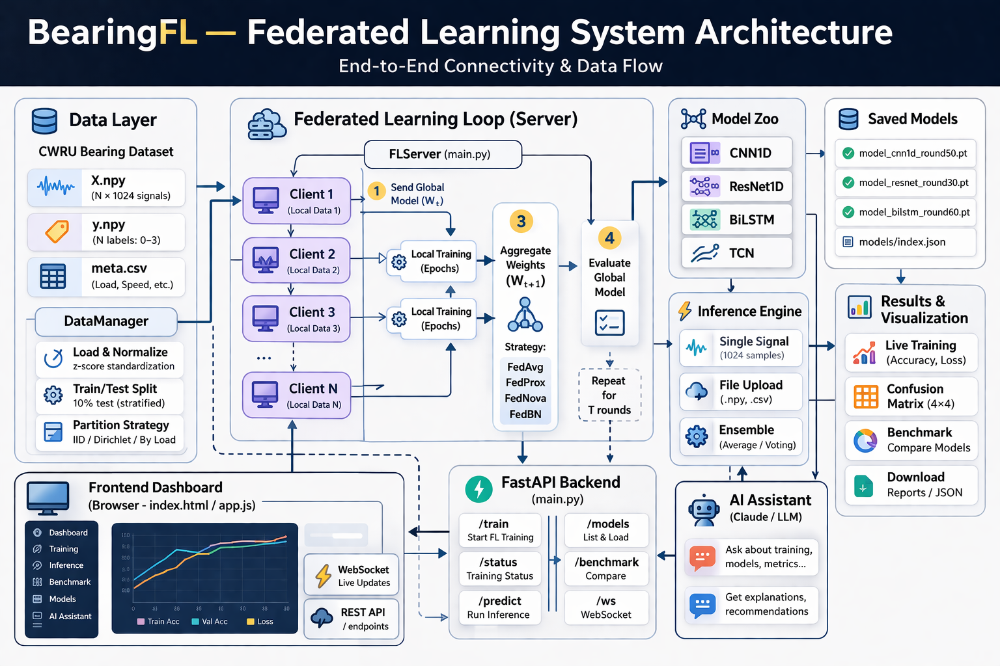

# BearingFL — Federated Learning Dashboard for Bearing Fault Diagnosis

A browser-based dashboard for training, comparing, and deploying federated learning models on the CWRU bearing vibration dataset. Supports four model architectures, four aggregation strategies, real-time training monitoring via WebSocket, multi-model inference, and an AI assistant.

---

## Table of Contents

1. [Overview](#overview)
2. [Project Structure](#project-structure)
3. [Dataset](#dataset)
4. [Models](#models)
5. [Federated Learning](#federated-learning)
6. [Training Settings](#training-settings)
7. [Dashboard Tabs](#dashboard-tabs)
8. [API Reference](#api-reference)
9. [AI Assistant](#ai-assistant)
10. [Setup & Running](#setup--running)
11. [Requirements](#requirements)

---


## Overview

BearingFL simulates a federated learning system locally — multiple clients each hold a private shard of the CWRU bearing dataset, train local models, and send only model weights (never raw data) to a central server for aggregation. The global model is evaluated after every round on a held-out test set, and training metrics are streamed live to the browser.

**Key capabilities**

| Feature | Details |
|---|---|
| Model architectures | CNN1D · ResNet1D · BiLSTM · TCN |
| FL aggregation | FedAvg · FedProx · FedNova · FedBN |
| Data partitioning | IID · Non-IID Dirichlet · By load condition |
| Clients | 2 – 20 simulated clients |
| Rounds | 1 – 100 communication rounds |
| Inference | Single signal or file upload; single or ensemble of saved models |
| Benchmarking | Side-by-side metric comparison across saved models |
| AI assistant | In-browser chatbot powered by Claude (optional) |

---

## Project Structure

```
Bearing Fault/
├── main.py               # FastAPI application — all REST endpoints and WebSocket
├── config.py             # FLConfig Pydantic model and constants
├── run.sh                # Launch script (activates venv, starts uvicorn)
├── requirements.txt      # Python dependencies
│
├── fl/
│   ├── models.py         # CNN1D, ResNet1D, LSTM1D (BiLSTM), TCN, build_model()
│   ├── aggregators.py    # fedavg, fedprox, fedbn, fednova
│   ├── client.py         # ClientTrainer — local training loop
│   ├── server.py         # FLServer — orchestrates rounds, saves models
│   ├── data_manager.py   # DataManager — partitioning, loaders
│   └── metrics.py        # evaluate_global, benchmark_model, confusion matrix
│
├── static/
│   ├── index.html        # Single-page application shell
│   ├── css/style.css     # All styles
│   └── js/app.js         # All frontend logic (Chart.js, WebSocket, API calls)
│
├── models/               # Saved model checkpoints (created at runtime)
│   └── index.json        # Model library metadata
│
├── X.npy                 # Signal windows  (N × 1024, float32)
├── y.npy                 # Labels          (N,  int64)
└── meta.csv              # Sample metadata (load condition, etc.)
```

---

## Dataset

**CWRU Bearing Dataset** — Case Western Reserve University

| Property | Value |
|---|---|
| Total samples | ~14,377 |
| Signal length | 1024 samples per window |
| Sampling rate | 12 kHz (drive-end accelerometer) |
| Classes | 4 |
| Preprocessing | Per-sample z-score normalisation |

**Fault classes**

| ID | Label | Description |
|---|---|---|
| 0 | Normal | No fault present |
| 1 | IR | Inner race fault |
| 2 | OR | Outer race fault |
| 3 | Ball | Rolling element (ball) fault |

A 10% stratified split is held out as the global test set before any client partitioning. This same split (seed = 42) is always used for benchmarking, ensuring fair comparison across models.

---

## Models

All models accept a raw 1-D vibration window of length 1024 and output 4-class logits. Input is z-score normalised before inference.

### CNN1D
Four progressively downsampling 1-D convolutional layers (channels 1→16→32→64→128) with BatchNorm and ReLU activations, followed by adaptive average pooling to 16 steps and two fully-connected layers (256 → 4).

### ResNet1D
A stem layer (conv7 + MaxPool) followed by three residual stages (64 → 128 → 256 channels) using `BasicBlock1D` with skip connections. Global adaptive average pooling and a single linear head.

### BiLSTM (`lstm1d`)
A CNN front-end (two conv layers: 1→32→64, stride 4 then 2) compresses 1024 time steps to ~128. A two-layer bidirectional LSTM (hidden=128, 256 total features) processes the sequence. The last time-step hidden state is classified by a linear head.

### TCN
Four `TCNBlock` residual blocks with exponentially growing dilations (1 → 2 → 4 → 8), channels 1→32→64→128→128, kernel size 5, GELU activations. Global adaptive average pooling followed by a linear head.

---

## Federated Learning

### Aggregation Strategies

| Strategy | Description |
|---|---|
| **FedAvg** | Weighted average of client weights, proportional to number of local training samples. |
| **FedProx** | Identical server aggregation to FedAvg. Adds a proximal term `μ ∥w − w_global∥²` to each client's loss to limit client drift. |
| **FedNova** | Normalised averaging that divides each client's weight update by the number of local gradient steps, correcting for heterogeneous local update counts. |
| **FedBN** | FedAvg but skips aggregation of BatchNorm running statistics (`running_mean`, `running_var`, `num_batches_tracked`). Each client keeps its own BN statistics, improving performance under non-IID data. |

### Data Partitioning Strategies

| Strategy | Description |
|---|---|
| **IID** | Training indices are shuffled and split uniformly across clients. Each client sees a similar class distribution. |
| **Non-IID Dirichlet** | Class proportions are drawn from a Dirichlet distribution with concentration parameter α. Lower α produces more heterogeneous clients. |
| **By Load** | Samples are grouped by motor load condition (from `meta.csv`) and assigned to clients in round-robin order. Simulates a realistic deployment where each machine operates under a specific load. |

### Training Loop

1. Server randomly selects `ceil(fraction_fit × num_clients)` clients per round.
2. Selected clients each receive a copy of the current global weights and run `local_epochs` of training.
3. Client weight updates are returned to the server and aggregated.
4. The global model is evaluated on the held-out test set and metrics are broadcast via WebSocket.
5. If `early_stopping_patience > 0` and global accuracy has not improved for that many rounds, training halts early.
6. On completion, the global model is saved to `models/` with full metadata.

---

## Training Settings

All settings are configurable from the dashboard sidebar.

### Data Partitioning

| Setting | Range / Options | Default |
|---|---|---|
| Number of Clients | 2 – 20 | 4 |
| Partition Strategy | IID · Dirichlet · By Load | IID |
| Dirichlet α | 0.05 – 10.0 | 0.5 |

### Federated Learning

| Setting | Range / Options | Default |
|---|---|---|
| Rounds | 1 – 100 | 10 |
| Fraction Fit | 0.1 – 1.0 | 1.0 |
| Aggregation Strategy | FedAvg · FedProx · FedNova · FedBN | FedAvg |
| FedProx μ | 0.0001 – 1.0 | 0.01 |
| Early Stopping Patience | 0 – 20 rounds (0 = off) | 0 |

### Local Training

| Setting | Range / Options | Default |
|---|---|---|
| Local Epochs | 1 – 20 | 3 |
| Batch Size | 16 · 32 · 64 · 128 · 256 | 64 |
| Learning Rate | 0.1 · 0.01 · 0.001 · 0.0001 | 0.001 |
| Optimizer | Adam · SGD · AdamW | Adam |
| LR Scheduler | None · StepLR (γ=0.9) · Cosine · Warmup+Cosine | None |
| Weight Decay | 0 · 1e-4 · 1e-3 · 1e-2 | 1e-4 |
| Gradient Clip | 0.0 – 5.0 (0 = off) | 1.0 |
| Label Smoothing | 0.00 – 0.30 | 0.00 |
| Data Augmentation | Gaussian noise on inputs | Off |
| Noise Std Dev | 0.001 – 0.500 | 0.010 |

### Model Architecture

| Setting | Options | Default |
|---|---|---|
| Model Type | CNN1D · ResNet1D · BiLSTM · TCN | CNN1D |
| Dropout | 0.00 – 0.90 | 0.30 |
| Random Seed | 0 – 99999 | 42 |

---

## Dashboard Tabs

### Dashboard
Live training monitor. Shows:
- Round progress bar and stat chips (round, best accuracy, elapsed time)
- Global accuracy and loss curves (Chart.js line charts, updated each round)
- Client participation table with per-client train/val accuracy and sample count
- Confusion matrix rendered after training completes
- Event log with timestamped INFO / SUCCESS / WARNING messages

### Predict
Run inference on a vibration signal using one or more saved models.

- **Signal input**: paste raw values, upload a `.npy` or plain-text file, or fetch a random sample from the dataset (optionally filtered by fault class)
- **Model selection**: choose any combination of saved models from the library
- **Results**: per-model prediction card showing fault class, confidence, and probability breakdown; ensemble result (majority vote + averaged probabilities) when multiple models are selected

### Benchmark
Compare saved models side by side on the same held-out test set.

- **Accuracy & Loss** bar chart
- **Inference Time** bar chart (wall-clock, milliseconds)
- **Radar chart** — per-class F1 across models
- **Per-class accuracy** grouped bar chart
- **Macro F1** grouped bar chart
- **Confusion matrix** for each model
- Summary table with accuracy, macro F1, precision, recall, inference time, and parameter count

---

## API Reference

### Health & Config

| Method | Path | Description |
|---|---|---|
| `GET` | `/api/health` | Returns `{"status":"ok","training":bool}` |
| `GET` | `/api/config/defaults` | Returns default `FLConfig` values |

### Model Library

| Method | Path | Description |
|---|---|---|
| `GET` | `/api/models` | List all saved models with metadata |
| `DELETE` | `/api/models/{model_id}` | Delete a model and its checkpoint file |

### Inference

| Method | Path | Description |
|---|---|---|
| `POST` | `/api/predict` | JSON body: `{signal: float[], model_ids: str[]}` |
| `POST` | `/api/predict/upload` | Multipart form: `file` (`.npy` or plain text) + `model_ids` |
| `GET` | `/api/predict/sample` | Random sample from dataset; optional `?class_id=0..3` |

### Benchmark

| Method | Path | Description |
|---|---|---|
| `POST` | `/api/benchmark` | JSON body: `{model_ids: str[]}` (max 12). Evaluates all on the same seed=42 test split. |

### Training

| Method | Path | Description |
|---|---|---|
| `POST` | `/api/train` | Start a training run. Body: full `FLConfig` JSON. |
| `POST` | `/api/stop` | Cancel the running training task. |

### Chat

| Method | Path | Description |
|---|---|---|
| `POST` | `/api/chat` | Body: `{message: str, history: [{role, content}]}`. Requires `ANTHROPIC_API_KEY`. |

### WebSocket

| Path | Description |
|---|---|
| `ws://localhost:8001/ws` | Real-time event stream during training. |

**WebSocket message types**

| Type | Sent when |
|---|---|
| `CONNECTED` | Client connects |
| `DATA_DISTRIBUTION` | After data partitioning |
| `ROUND_START` | Each round begins (includes selected client IDs) |
| `ROUND_COMPLETE` | Each round ends (global metrics, per-client stats) |
| `TRAINING_COMPLETE` | All rounds done (model ID, confusion matrix, best accuracy) |
| `TRAINING_ERROR` | Unhandled exception during training |
| `LOG` | Info / success / warning log messages |

---

## AI Assistant

An in-browser chatbot is available via the circular button in the bottom-right corner. It is powered by Claude and has full context about the BearingFL system including model architectures, FL strategies, training settings, and dashboard features.

**Enable it by setting an environment variable before starting the server:**

```bash
export ANTHROPIC_API_KEY=sk-ant-...
./run.sh
```

Without the key the assistant still opens but returns a setup message instead of AI responses. Conversation history (last 10 exchanges) is sent with each request for multi-turn context. The model used is `claude-haiku-4-5` for fast responses.

---

## Setup & Running

### 1. Prerequisites

- Python 3.10 or later
- The CWRU data files must be present in the project root: `X.npy`, `y.npy`, `meta.csv`

### 2. Create a virtual environment and install dependencies

```bash
cd "Bearing Fault"
python -m venv venv
source venv/bin/activate          # Windows: venv\Scripts\activate
pip install -r requirements.txt
```

### 3. Start the server

```bash
./run.sh
```

Or manually:

```bash
source venv/bin/activate
uvicorn main:app --host 0.0.0.0 --port 8001 --reload
```

### 4. Open the dashboard

```
http://localhost:8001
```

### 5. Optional — enable the AI assistant

```bash
export ANTHROPIC_API_KEY=sk-ant-...
./run.sh
```

---

## Requirements

```
fastapi>=0.115
uvicorn[standard]>=0.29
websockets>=12.0
torch>=2.1
numpy>=1.26
pandas>=2.0
scikit-learn>=1.4
scipy>=1.12
aiofiles>=23.2
pydantic>=2.5
anthropic>=0.25
```

GPU acceleration is used automatically if a CUDA device is available (`torch.cuda.is_available()`). All models are saved and loaded to CPU for inference regardless of training device.
